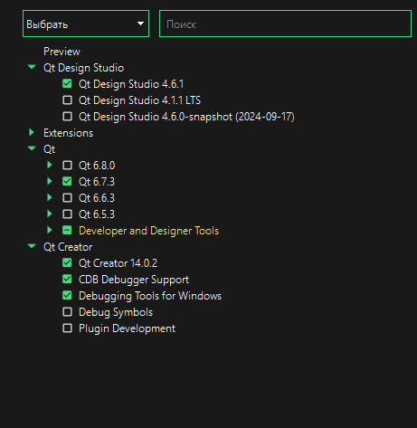

# WPS
Wizard's Picture Studio
## Table of Contents

- [About](#about)
- [Installing](#installing)

## About 

Russian open source graphic raster editor.

## Installing 

1. Пройти регистрацию и скачать QT https://www.qt.io/

2. При установке .exe войти в аккаунт. 

3. Слева внизу настройки. Ручная настройка прокси сервера - ставим proxy.quterussia.ru и порт 31031

4. Дальше простро устанавливаем и ожидаем..

PS. Так же у вас должен быть установлен CMake, MSVC(Чтобы просто не заморачиваться, можно скачать Microsoft Visual Studio, и тогда автоматом поставится MSVC) 2022 64amd. Базовые расширения дл Qt в VScode. Так же для себя можно установить кучу разных классных расширений для упрощени работы)
